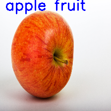

# Simple Custom_Object_Classification with pytorch

Simple Custom object classification with pytorch | Custom Model | Custom dataset | ONNX inference

- Genric Data preparation
- Installation
- Training
- Testing
- Onnx model inference

**Gallery**
<p float="left">


</p>


### Genric Data preparation
- Prepare the dataset like below tree

```
    - data
        - Fruits (dataset name)
            - train
                - class 1
                - class 2
                - ...
                - class n
            - val
                - class 1
                - class 2
                - ...
                - class n
            - test
                - class 1
                - class 2
                - ...
                - class n
```
- I have took fruits dataset from kaggle for example purpose [link here](https://www.kaggle.com/datasets/shreyapmaher/fruits-dataset-images)
- change the path name in "train_dir" and "val_dir" in main.py

### Installation

    - pip install -r requirements.txt

### Training
    - python main.py

### Testing
Make sure if you have changed weights filename, train folder, input image in predict.py 

    - python predict.py

### Exporting
Make sure if you have changed the weights filename in export.py

    - python export.py

### Onnx model inference
Make sure if you have changed weights filename, train folder, input image in predict.py 

    - python onnx_inference.py

Kindly raise issues or mail me if you have any questions

Medium blog - [here](https://medium.com/@ajithkumarv/8a19e5ca5e27)

**Credits**
- [Custom-CNN-based-Image-Classification-in-PyTorch](https://github.com/developer0hye/Custom-CNN-based-Image-Classification-in-PyTorch)
- [Creating custom dataloader](https://medium.com/analytics-vidhya/creating-a-custom-dataset-and-dataloader-in-pytorch-76f210a1df5d)
